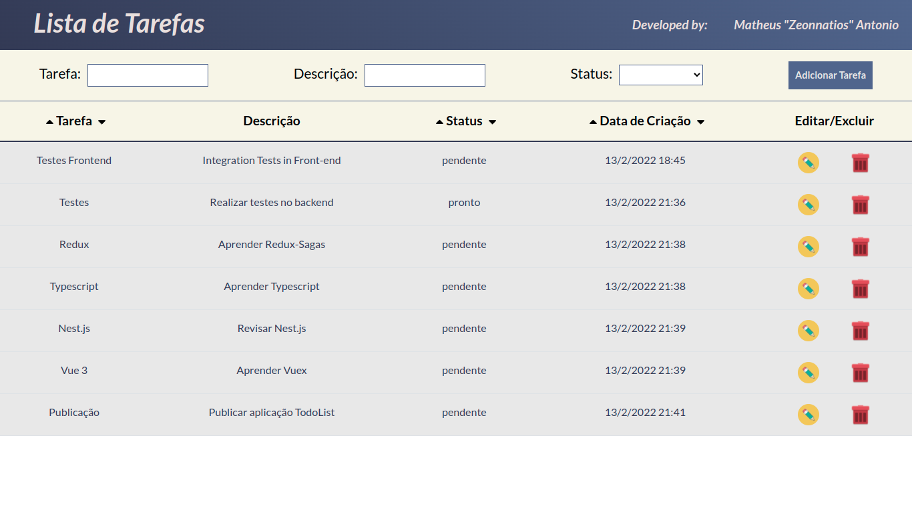

<h1 align="center">Lista de Tarefas</h1>

<p align="center">Olá, seja bem vindo(a). Este é o projeto Lista de Tarefas durante a semana do 1º "Blitz de Carreira" na Trybe!</p>

 <p align="center">
  <a href="#bookmark-sobre">Sobre</a>&nbsp;&nbsp;&nbsp;|&nbsp;&nbsp;&nbsp;
  <a href="#rocket-tecnologias">Tecnologias</a>&nbsp;&nbsp;&nbsp;|&nbsp;&nbsp;&nbsp;
  <a href="#hammer_and_wrench-features">Features</a>&nbsp;&nbsp;&nbsp;|&nbsp;&nbsp;&nbsp;
  <a href="#cloud-api">API</a>&nbsp;&nbsp;&nbsp;|&nbsp;&nbsp;&nbsp;
  <a href="#notebook-instalação">Instalação</a>&nbsp;&nbsp;&nbsp;|&nbsp;&nbsp;&nbsp;
  <a href="#cloud-deploy">Deploy</a>&nbsp;&nbsp;&nbsp;|&nbsp;&nbsp;&nbsp;
  <a href="#technologist-autor">Autor</a>&nbsp;&nbsp;&nbsp;|&nbsp;&nbsp;&nbsp;
</p>

<h2>:bookmark: Sobre</h2>
<p>
Esse projeto se trata do desenvolvimento de uma aplicação feita em react, fazendo requisições a uma API, para fazer o CRUD de tarefas, sendo assim, possível de criar, listar, editar e excluir uma tarefa.
</p>


<h2>:rocket: Tecnologias</h2>

 Este projeto foi feito utilizando:

- [React](https://pt-br.reactjs.org/)
- [React Testing Library](https://testing-library.com/docs/react-testing-library/intro/)
- [Axios](https://axios-http.com/docs/intro)
- [Eslint Airbnb](https://eslint.org/)


<h2>:hammer_and_wrench: Features</h2>

- [x] Criar uma tarefa
- [x] Listar uma tarefa
- [x] Editar uma tarefa
- [x] Excluir uma tarefa
- [x] Ordenar tarefas por status
- [x] Ordenar tarefas por data de criação
- [x] Ordenar tarefas em ordem alfabética

<h2>:cloud: API</h2>

- [API Backend](https://zeonnatios-tasks-backend.herokuapp.com/tasks) - API utilizada, hospedada no

<h2>:notebook: Instalação</h2>
<h3>Pré-requisitos</h3>

Antes de começar, você vai precisar ter instalado em sua máquina as seguintes ferramentas: 

 **Node**: [Download Node.js](https://nodejs.org/en/download/)
 
 **Git**: [Download Git](https://git-scm.com/downloads)

 **Yarn**: [Install Yarn](https://yarnpkg.com/getting-started)

 (A escolha de utilizar o NPM ou o Yarn é de sua escolha)

 <h3>Rodando a aplicação</h3>

 ```bash
 # Clone este repositório:
$ git clone https://github.com/Zeonnatios/ebytr-challenge-frontend.git

# Instale as dependências:
$ npm install ou yarn install

# Execute a aplicação com:
$ npm start ou yarn start

# O servidor inciará na porta: 3000 - acesse <http://localhost:3000/>

# Para rodar todos os testes, execute:
$ npm run test ou yarn test

# Para verificar a cobertura de testes, execute:
$ npm run test:coverage ou yarn test:coverage

```

## :cloud: Deploy

Link do deploy da aplicação no heroku: <https://zeonnatios-tasks-frontend.herokuapp.com/>


## :technologist: Autor:

<div align="left">
  <a href="https://github.com/Zeonnatios">
    <div align="left">
      
      <br />
      <b>Matheus Antonio</b>
    </div>
  </a>
  <br />
  <a href="https://www.linkedin.com/in/matheusantoniosilva" title="Linkedin Matheus Antonio">Meu Linkedin</a>
</div>